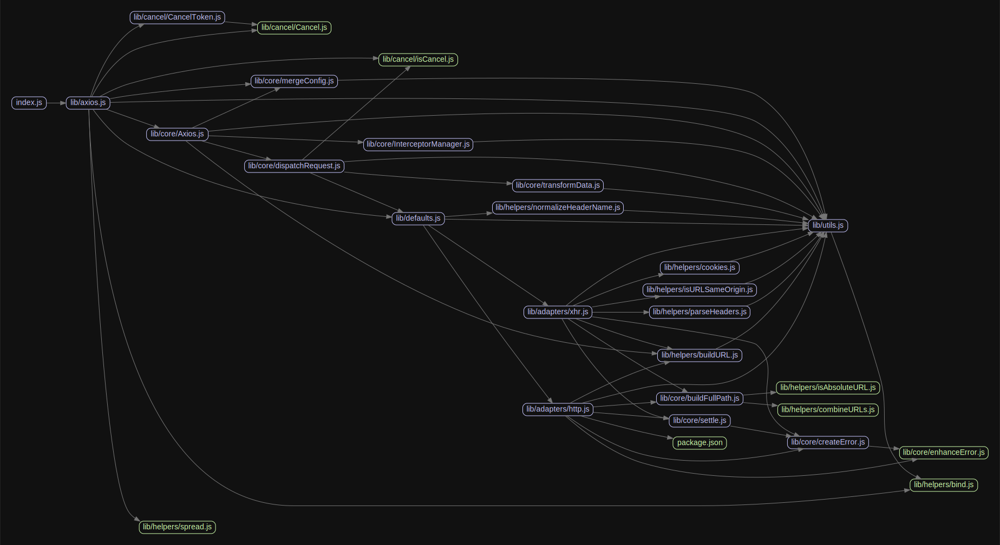

# 源码分析

## 文件结构

``` bash
/Users/liufang/openSource/FunnyLiu/axios
├── CHANGELOG.md
├── CODE_OF_CONDUCT.md
├── COLLABORATOR_GUIDE.md
├── CONTRIBUTING.md
├── COOKBOOK.md
├── ECOSYSTEM.md
├── Gruntfile.js
├── LICENSE
├── README.md
├── UPGRADE_GUIDE.md
├── bower.json
├── dist
|  ├── axios.js
|  ├── axios.map
|  ├── axios.min.js
|  └── axios.min.map
├── examples
|  ├── README.md
|  ├── all
|  |  └── index.html
|  ├── amd
|  |  └── index.html
|  ├── get
|  |  ├── index.html
|  |  └── server.js
|  ├── post
|  |  ├── index.html
|  |  └── server.js
|  ├── server.js
|  ├── transform-response
|  |  └── index.html
|  └── upload
|     ├── index.html
|     └── server.js
├── index.d.ts
├── index.js
├── karma.conf.js
├── lib
|  ├── adapters
|  |  ├── README.md
|  |  ├── http.js
|  |  └── xhr.js
|  ├── axios.js
|  ├── cancel
|  |  ├── Cancel.js
|  |  ├── CancelToken.js
|  |  └── isCancel.js
|  ├── core
|  |  ├── Axios.js
|  |  ├── InterceptorManager.js
|  |  ├── README.md
|  |  ├── buildFullPath.js
|  |  ├── createError.js
|  |  ├── dispatchRequest.js
|  |  ├── enhanceError.js
|  |  ├── mergeConfig.js
|  |  ├── settle.js
|  |  └── transformData.js
|  ├── defaults.js
|  ├── helpers
|  |  ├── README.md
|  |  ├── bind.js
|  |  ├── buildURL.js
|  |  ├── combineURLs.js
|  |  ├── cookies.js
|  |  ├── deprecatedMethod.js
|  |  ├── isAbsoluteURL.js
|  |  ├── isURLSameOrigin.js
|  |  ├── normalizeHeaderName.js
|  |  ├── parseHeaders.js
|  |  └── spread.js
|  └── utils.js
├── package.json
├── sandbox
|  ├── client.html
|  ├── client.js
|  └── server.js
└── webpack.config.js

directory: 23 file: 109

ignored: directory (1)

```

## 外部模块依赖

请在： http://npm.broofa.com?q=axios 查看

## 内部模块依赖


  